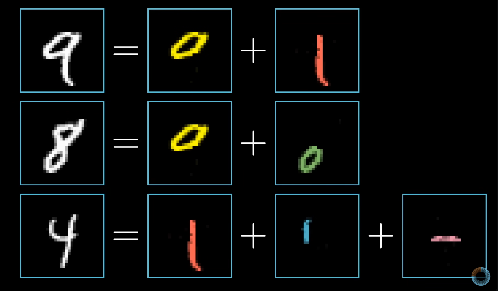
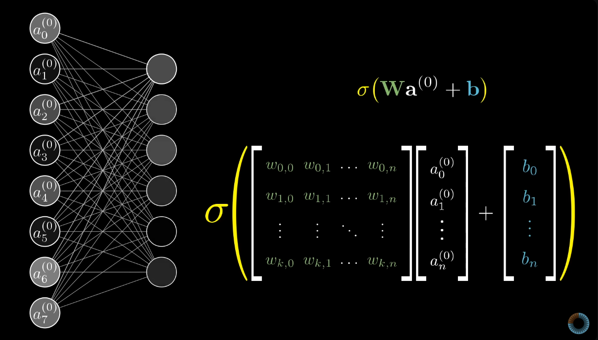
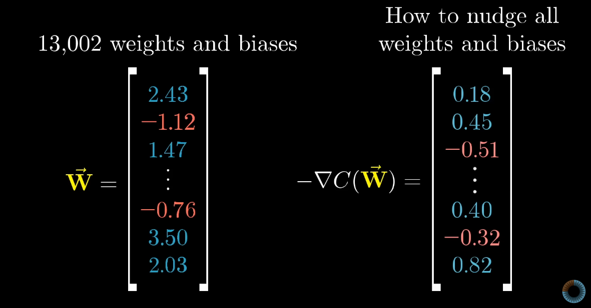

# Neural Networks

---

---

### Introduction

- Neuron : Something that holds a number (specifically 0<n<1)
    
    0 for black 
    
    1 for white
    
- They are functions that hold values from the functions in the previous layer
- 28*28 i.e. 784 neurons make up the 1st layer
- Last layer has 10 neurons
- The layers between the 2 layers are hidden layers

 

### Why layers?

- A particular number can b broken down into recurring patterns
- This shall be done in one layer

- These patterns can further be broken down into edges
- This shall b done in some layer other than the above mentioned layer

- Basically :
    
    pixels → edges → patterns → digits
    

## Weights and Biases

- What parameters should exist ?

→  Weights are assigned to the connections between the neurons in the current layer and the

previous layer

→ Every connection has a separate weight 

→ Every neuron in the ‘next’ layer has a specific bias 

- What is the significance of WEIGHTS

→  Product of weight and activation is taken and all these products are added..this is weighted sum

→ Some weights are negative and some are positive 

→ weighted some will b largest when 

+ve weights have high activation 

-ve weights have low activation 

→ this will tell us about the pattern in the previous layer 

→ this weighted sum is passed through a ************************SIGMOID function************************

→ **SIGMOID : old … ReLu : new**  

- What are BIASES ?

→ If we require a certain threshold , only above which a neuron is activated , we add a bias to the

weighted sum before passing it through the sigmoid(ReLu) function

## Cost function

- Weights and biases are initialized randomly
- The network gives out a thrash output
- **ADD the SQUARES of the DIFFERENCES of the values from trash output and the desired values**
- This is called cost of a single training example
- Cost is low → accuracy is high
    
    Cost is high → accuracy is low 
    
- Average is taken ; average indicates the accuracy

 

## Gradient descent

- We try to minimize the cost function to get the best possible values for the weights and biases

- This is done by taking the ‘GRADIENT’ of the function (Gradient gives steepest ascent)
- Negative of Gradient tells us the steepest possible way to decrease the function
- Length of the Gradient vector is an indication of how steep the steepest slope is
- compute steepest path → take small step downhill → repeat

## Back Propagation

- We keep track of the adjustments we wish take place to the output layer
- The size of these adjustments should be proportional to how off the current value is
- Ways to in crease the activation of a neuron in the NEXT layer (changes done to PREV layer) :
    - increase the bias
    - increase the weights :
        
        → proportional to activation
        
    - change the activation :
        
        → proportional to weights 
        
- Such adjustments required for the neurons in the entire NEXT layer lead to adjustments in the weights and biases of the connection between the two layers
- All these adjustments are averaged (w.r.t. particular neurons)
- The process is repeated by considering second to last and third to last layers and so on