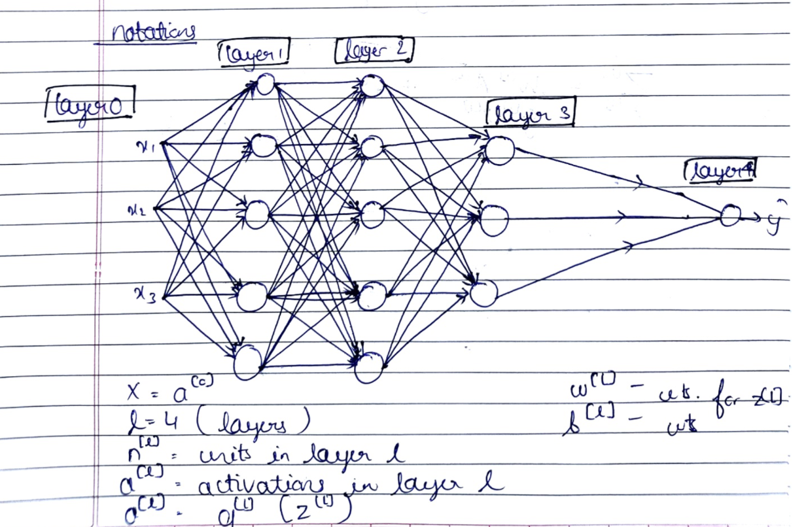

# Course 1

---

---

# Notations used

[notations(NN).pdf](Images/notations(NN).pdf)

# Week 1

## What is a Neural Network

- ReLU function :
    
    → Rectified Linear Units 
    
    → stays at 0 and then takes off as a straight line 
    

## Supervised Learning with Neural Networks

- Different applications have different architecture of neural network that is used
    
    → CV : CNNs
    
    → Audio related (sequential data) : RNNs
    
    → Autonomous driving : Custom / Hybrid 
    

 

- Structured data : Databases (tables etc.)
- Unstructured data : images , audio files , text , etc.

---

# Week 2

## Binary Classification

- Takes an input and gives an output in **True(1)** or **False(0)**
- For example :
    - Take an input of an image of a cat ; assume it has 64*64 pixels
    - computer stores data as 3 matrices of 64*64 for red ,green ,blue
    - now to convert data into an input feature vector we unroll all the pixel values
    - the total dimension of this vector x will be 64*64*3=12288 because that's the total numbers we have in all of these matrices
        
        
        
        representation of : ^feature vector                 ^output 
        
    

## Logistic Regression

- Used when output is 1 or 0 i.e. for binary classification
- Gives us the probability that the output Y is equal to the given input X
- To calculate the probability , the parameters **‘w’ and ‘b’** are enclosed in a **sigmoid** function
    
    → sigmoid function keeps the values confined as follows **0<sigmoid<1**
    
    
    

## Logistic Regression Cost Function

- The **Mean Square Loss** is by far the simplest way to calculate loss
- It suffers from certain optimisation problems, particularly with multiple **local optima**.
- Loss Function : Calculates error for a single training example
    
    
    
    Cost Function : Calculates the average of all the losses for each training example i.e. calculates the error for entire dataset
    
    
    

## Gradient Descent

- **‘w’ and ‘b’**  are randomly initialized and they are continuously updated so that the value of cost function is minimized
- To do so , we take a *step*  in the *steepest downhill direction* (cost function is a convex function)
- Repeat this over a number of iterations
    
    
    
    
    

## Derivatives with Computation Graph

- A **Forward Pass** involves passing in inputs and generating an output.
- A **Backward Pass** involves computing the derivatives of the **Loss Function**, wrt each weight and bias of the network using the chain rule of derivatives.

## **Logistic Regression Gradient Descent**

- For a **Logistic Regression** model derivatives can be easily computed as :
    1. da = -y/a + (1-y)/(1-a)
    2. dz = a-y
    3. dw = X*dz
    4. db = dz
    
    
    

## Gradient Descent on ‘m’ examples

- Lets say we have these variables:
    
    ```python
    X1            Feature
    X2            Feature
    W1            Weight of the first feature.
    W2            Weight of the second feature.
    B             Logistic Regression parameter.
    M             Number of training examples
    Y(i)		      Expected output of i
    ```
    
- So we have:
    
    
    
- Then from right to left we will calculate derivations compared to the result:
    
    ```python
    d(a)  = d(l)/d(a) = -(y/a) + ((1-y)/(1-a))
    	d(z)  = d(l)/d(z) = a - y
    	d(W1) = X1 * d(z)
    	d(W2) = X2 * d(z)
    	d(B) = d(z)
    ```
    
- From the above we can conclude the logistic regression pseudo code:
    
    ```python
    J = 0; dw1 = 0; dw2 =0; db = 0;                 # Devs.
    	w1 = 0; w2 = 0; b=0;							# Weights
    	for i = 1 to m
    		# Forward pass
    		z(i) = W1*x1(i) + W2*x2(i) + b
    		a(i) = Sigmoid(z(i))
    		J += (Y(i)*log(a(i)) + (1-Y(i))*log(1-a(i)))
    		
    		# Backward pass
    		dz(i) = a(i) - Y(i)
    		dw1 += dz(i) * x1(i)
    		dw2 += dz(i) * x2(i)
    		db  += dz(i)
    	J /= m
    	dw1/= m
    	dw2/= m
    	db/= m
    	
    	# Gradient descent
    	w1 = w1 - alpa * dw1
    	w2 = w2 - alpa * dw2
    	b = b - alpa * db
    ```
    

## Vectorization

- Vectorization allows the elimination of the for-loops in python code.

```python
250069.16704749785 
Vectorized version: 2.0003318786621094ms 
250069.16704750186 
For loop:  236.63949966430664ms
```

- The time required to run vectoized version is almost 100x non-vectorized version

## Vectoizing Logistic Regression

- With the help of vectorization the code written in *gradient descent on ‘m’ variables*  can be condensed to :
    
    ```python
    Z = np.dot(W.T,X) + b    # Vectorization, then broadcasting, Z shape is (1, m)
      	A = 1 / 1 + np.exp(-Z)   # Vectorization, A shape is (1, m)
    ```
    
- Vectorizing Logistic Regression’s Gradient Output :

```python
dz = A - Y                  # Vectorization, dz shape is (1, m)
  	dw = np.dot(X, dz.T) / m    # Vectorization, dw shape is (Nx, 1)
  	db = np.sum(dz) / m           # Vectorization, db shape is (1, 1)
```

## Broadcasting in Python

- If we try to operate on two matrices and one of them has lesser rows/columns , python auto-expands the matrices by repeating values
    
    
    

---

# Week 3

## Neural Network Representation

- Neural Networks : stacking of sigmoid functions
- Hidden Layers : you cannot see in training set
- Activations : values passed by subsequesnt layers
- 1st layer : input layer
    
    Last layer : output layer 
    
    Layers in between : hidden layers 
    
- Input layer is not counted as a layer , so a NN with input layer ,1 hidden layer ,output layer is called a 2 layer NN
- Activations of each layer are represented by **a<sup>[i]<sup>** where i is the layer number
    
    
    
- Parameters w and b are associated with the layers are also represented with superscripts
    
    w : a matrix [no. of neurons, no. of features]
    
    b : a vector [no. of neuron , 1]
    
- Equations of hidden layers :
    
    
    
- Here are some informations about the last image:
    - `noOfHiddenNeurons = 4`
    - `Nx = 3`
    - Shapes of the variables:
        - `W1` is the matrix of the first hidden layer, it has a shape of `(noOfHiddenNeurons,nx)`
        - `b1` is the matrix of the first hidden layer, it has a shape of `(noOfHiddenNeurons,1)`
        - `z1` is the result of the equation `z1 = W1*X + b`, it has a shape of `(noOfHiddenNeurons,1)`
        - `a1` is the result of the equation `a1 = sigmoid(z1)`, it has a shape of `(noOfHiddenNeurons,1)`
        - `W2` is the matrix of the second hidden layer, it has a shape of `(1,noOfHiddenNeurons)`
        - `b2` is the matrix of the second hidden layer, it has a shape of `(1,1)`
        - `z2` is the result of the equation `z2 = W2*a1 + b`, it has a shape of `(1,1)`
        - `a2` is the result of the equation `a2 = sigmoid(z2)`, it has a shape of `(1,1)`
        

## Vectorizing Across Multiple Examples

- Pseudo code for forward propagation for the 2 layers NN:

```
for i = 1 to m
  z[1, i] = W1*x[i] + b1      # shape of z[1, i] is (noOfHiddenNeurons,1)
  a[1, i] = sigmoid(z[1, i])  # shape of a[1, i] is (noOfHiddenNeurons,1)
  z[2, i] = W2*a[1, i] + b2   # shape of z[2, i] is (1,1)
  a[2, i] = sigmoid(z[2, i])  # shape of a[2, i] is (1,1)

```

- Lets say we have `X` on shape `(Nx,m)`. So the new pseudo code:

```
Z1 = W1X + b1     # shape of Z1 (noOfHiddenNeurons,m)
A1 = sigmoid(Z1)  # shape of A1 (noOfHiddenNeurons,m)
Z2 = W2A1 + b2    # shape of Z2 is (1,m)
A2 = sigmoid(Z2)  # shape of A2 is (1,m)

```

- If you notice always m is the number of columns.
- In the last example we can call `X` = `A0`. So the previous step can be rewritten as:
    
    ```
    Z1 = W1A0 + b1    # shape of Z1 (noOfHiddenNeurons,m)
    A1 = sigmoid(Z1)  # shape of A1 (noOfHiddenNeurons,m)
    Z2 = W2A1 + b2    # shape of Z2 is (1,m)
    A2 = sigmoid(Z2)  # shape of A2 is (1,m)
    
    ```
    

## Activation Functions

- Examples of activation function :
    
    sigmoid    0<a<1 :
    
    A = 1 / (1 + np.exp(-z))
    
    tan h(z)   -1<a<1 :
    
    In NumPy we can implement ‘tan h’ using one of these methods:
    
    `A = (np.exp(z) - np.exp(-z)) / (np.exp(z) + np.exp(-z)) Or A = np.tanh(z)`
    
    ReLU        0<a<max :
    
    ReLU = max(0,z) 
    
    Leaky ReLU : ReLU but has a non-zero slope on the negative side 
    
    Leaky ReLU = max(0.01z,z), the 0.01 can be a parameter for your algorithm.
    
- Rules of thumb for choosing activation function :
    
    → For binary classification i.e. output between 0 and 1 : sigmoid function
    
    → tan h is superior that sigmoid ; except binary classification 
    
    → Not sure what to use : ReLU (default choice)
    

## Derivatives of Activation Functions

- The derivatives of the activation functions are as:
    
    
    | tan h | sigmoid | ReLU |
    | --- | --- | --- |
    | 1 - tan h(z)^2 | sigmoid(z)(1-sigmoid(z)) | 0 if z<0 else 1 |

## Gradient Descent for Neural Networks Random Initialization

- We prefer to initialize weights randomly rather than to zero, as this leads to each node of the layer computing the exact same function, even after gradient descent, which is not intended
- To solve this we initialize the W's with a small random numbers:
    
    `W1 = np.random.randn((2,2)) * 0.01    # 0.01 to make it small enough
    b1 = np.zeros((2,1))                   # its ok to have b as zero,` 
    
- Biases do not have this problem, and can be initialized to zero.
- We initialize the weights to small values, to prevent the activation function from reaching saturation, where the gradient is near zero, thereby slowing down training.
- Including more nodes in hidden layers leads to better results, but after a certain point, causes **overfitting**, which is what happens when the model sticks to the learned data too much and struggles to make new predictions

---

# Week 4

## Deep Neural Networks

- Shallow NNs : NNs with less(1 or 2) layers
    
    → Logistic regression is a shallow neural network 
    
- Deep NNs : NNs with more(>2) layers
    
    
    

## Forward Propagation in Deep Neural Networks

- Forward propagation general rule for one input:

```
	z[l] = W[l]a[l-1] + b[l]
	a[l] = g[l](a[l])

```

- Forward propagation general rule for `m` inputs:

```
	Z[l] = W[l]A[l-1] + B[l]
	A[l] = g[l](A[l])

```

- We can't compute the whole layers forward propagation without a for loop so its OK to have a for loop here.

## **Getting your Matrix Dimensions Right**

- Dimension of `W` and `dw`are `(n[l],n[l-1])`
- Dimension of `b`and `db` are `(n[l],1)`
- Dimension of `Z[l],` `dZ[l]`, `A[l]`, and `dA[l]` are `(n[l],m)`

## Why Deep Representation

- Deep NNs start off by simple things and keep grouping up the simple information to make it more and more complex
- Example : Facial recognition
    
    Image → Edges → Facial features → Faces → Desired Face 
    
    Example : Audio detection 
    
    Input sound → low level sounds (like ss) → Phonemes → words/phrases → Sentences
    

## Building Blocks of Deep Neural Networks

- Forward Propagation :
    
    ```
    Input  A[l-1] => Output A[l]
    Z[l] = W[l]A[l-1] + b[l]
    A[l] = g[l](Z[l])
    cache : Z[l] , W[l] , b[l] , A[l-1] (to be used for backward_propagation)
    ```
    
- Backward Propagation :
    
    ```
    Input da[l], Caches => Output dA[l-1], dW[l], db[l]
    dZ[l] = dA[l] * g'[l](Z[l])
    dW[l] = (dZ[l]A[l-1].T) / m
    db[l] = sum(dZ[l])/m              
    dA[l-1] = w[l].T * dZ[l]            
    
    ```
    

## Parameters v/s Hyperparameters

- Parameters :
    
    W[1]  , b[1] , W[2] , b[2] , …..
    
- Hyperparameters : They ultimately control the parameters
    
    Learning rate ⇒ alpha 
    
    number of iterations 
    
    Choice of activation function 
    
    Number of layers ⇒ L 
    
    Hidden Units n[0] , n[1] , ……. 
    
- Deep learning is an experimental process
    
    
    

---

---