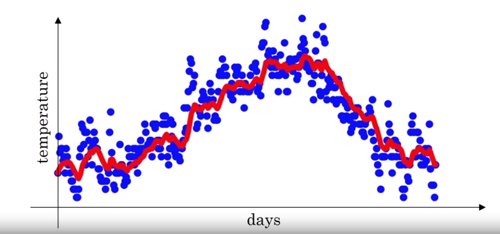
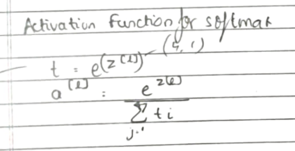

# Course 2

---

---

# Week 1

## Train / Dev / Test Sets

- Your data will be split into three parts:
    - Training set. (Has to be the largest set)
    - Hold-out cross validation set / Development or "dev" set.
    - Testing set.
- so the trend on the ratio of splitting the models:
    - If size of the dataset is 100 to 1000000 ==> 60/20/20
    - If size of the dataset is 1000000 to INF ==> 98/1/1 or 99.5/0.25/0.25
- The goal of dev set id to see which algorithm works the best
- The goal of test set is to check the accuracy of the algorithm
- Dev and test sets should come from the same distribution

## Bias and Variance

- Bias :
    
    Bias refers to the error due to overly simplistic assumptions in the learning algorithm.
    
- Variance :
    
    Variance is the error due to the model’s sensitivity to fluctuations in the training data
    
- Underfitting :
    
    High **bias** leads to the problem of **underfitting**.
    
- Overfitting :
    
    High **variance** leads to the problem of **overfitting**.
    
    
    

- Note that the train and dev errors are measured relative to the **human error**, or **optimal bayes error**.
- That is, if the **optimal bayes error** itself is around 15%, then actual train dataset error of 18% isn't too bad.

| Train set error | 1% | 15% | 15% | 0.5% |
| --- | --- | --- | --- | --- |
| Dev set Error | 11% | 16% | 30% | 1% |
| Issues | High Variance  | High Bias  | High Variance ,      High Bias  | Low Variance ,          Low bias |

## Basic Recepie for Machine Learning

- If your algorithm has a high bias:
    - Try to make your NN bigger (size of hidden units, number of layers)
    - Try a different model that is suitable for your data.
    - Try to run it longer.
    - Different (advanced) optimization algorithms.
- If your algorithm has a high variance:
    - More data.
    - Try regularization.
    - Try a different model that is suitable for your data.
- In the older days before deep learning, there was a "Bias/variance tradeoff". But because now you have more options/tools for solving the bias and variance problem its really helpful to use deep learning.

## Regularization

- Regularization is used when you have an overfitting problem due to high variance
- L1 matrix norm:
    - `||W|| = Sum(|w[i,j]|) # sum of absolute values of all w`
- L2 matrix norm mostly referred  to as Frobenius norm:
    - `||W||^2 = Sum(|w[i,j]|^2)	# sum of all w squared`
    - Also can be calculated as `||W||^2 = W.T * W if W is a vector`
- Gradient descent for regularized terms is known as **Weight Decay**
    
    
    

## Why Does Regularization Reduce Overfitting ?

- Case 1:
    - If `lambda` is too large - a lot of w's will be close to zeros which will make the NN simpler (you can think of it as it would behave closer to logistic regression).
    - If `lambda` is good enough it will just reduce some weights that makes the neural network overfit.
- Case 2 (with **tan h** activation function):
    - If `lambda` is increased, the cost function is penalised for larger weights, leading to smaller values of the weight matrices.
    - For smaller values of *w*, the value of *z* computed will also be smaller.
    - Finally, for smaller *z*, the activation function (say **tan h**) exhibits linear behavior as shown in the figure.
    - Thus the neural network ends up computing more linear functions, which have less capability to **overfit**.
    

## Dropout Regularization

- The dropout regularization eliminates some neurons/weights on each iteration based on a probability.
- Inverted Dropout :
    - pseudo code
    
    ```python
    keep_prob = 0.8   # 0 <= keep_prob <= 1
    l = 3  # this code is only for layer 3
    # the generated number that are less than 0.8 will be dropped. 80% stay, 20% dropped
    d3 = np.random.rand(a[l].shape[0], a[l].shape[1]) < keep_prob
    
    a3 = np.multiply(a3,d3)   # keep only the values in d3
    
    # increase a3 to not reduce the expected value of output
    # (ensures that the expected value of a3 remains the same) - to solve the scaling problem
    a3 = a3 / keep_prob
    ```
    
- Do not use dropout at test as it will add noise to the predictions
    
    → predictions don’t need to be random 
    

## Understanding Dropout

- Intuition :
    
    → Can’t rely on any one feature , so have to spread out the weights
    
    → The effect is somewhat similar to L2 regularization
    
    - Input should have `keep_prob`=1 (or near 1) as we don’t want to eliminate many features
    - Best way is to apply dropout to some layers and not to others , then just one hyperparameter which is a `keep_prob` for the layers you dont want to apply them
    - Drawback :
        
        →cost function J is not well defined and it will be hard to debug (plot J by iteration).
        
        → To solve that you'll need to turn off dropout, set all the `keep_prob`s to 1, and then run   the code and check that it monotonically decreases J and then turn on the dropouts again.
        

## Other Regularization Method

- Data Augmentation :
    - If additional data is expensive or not available, then you can augment the existing data, by say, laterally inverting the image, zooming and cropping the image, introducing random distortions, etc.
    - This does not work as well as fresh data would, but it does work, and can teach your model that any cat image inverted laterally is still a cat image.
- Early stopping :
    - **Early Stopping** refers to stopping training earlier, at the point where error of dev set is minimum.
    - Because we stop at earlier iterations, the values of weights are also smaller, closer to the small values we initialised with.
        
        
        
    - However, the major disadvantage of this, is that the cost function is not fully optimised as we stop training early.

## Normalizing Inputs

- Subtract the mean :
    
    → this effectively centers the data 
    
- Normalize variance :
    
    `X /= variance`
    
- Why normalize ? :
    - If we don't normalize the inputs our cost function will be deep and its shape will be inconsistent (elongated) ⇒ then optimizing it will take a long time.
    - If we normalize the shape of the cost function will be consistent (sphere like) and we can use a larger learning rate alpha ⇒ the optimization will be faster.
        
        
        

## Vanishing / Exploding Gradients

- if the **weights>1/weights<1**, then the output values goes on **increasing/decreasing exponentially**.
- Similar to the activations, gradients too will **increase/decrease exponentially**.
- This makes it very hard to train, as if the gradients explode, then gradient descent would **diverge**.
- On the other hand, if the gradients vanish, it would take exponentially more steps to **converge**.

## **Weight Initialization for Deep Networks**

- A partial solution to the Vanishing / Exploding gradients in NN is better or more careful choice of the random initialization of weights
- set the **variance of initialized weight matrices for a layer, close to unity**.
    
    
    

## Gradient Checking

- For **n-layer** models, the **backpropagation** step is extremely complicated in implementation.
- For this purpose its helpful to check the values of gradients computed by the backprop step against our own **approximations** of it.
- If the difference between the two is negligible, then we know our backpropagation works fine!
- This is done with the help of following equations:
    
    
    
    
    

## Gradient Checking Implementation Notes

- Don't use the gradient checking algorithm at training time because it's very slow.
- Use gradient checking only for debugging.
- If algorithm fails grad check, look at components to try to identify the bug.
- Don't forget to add `lamda/(2m) * sum(W[l])` to `J` if you are using L1 or L2 regularization.
- Gradient checking doesn't work with dropout because J is not consistent.
    - You can first turn off dropout `keep_prob = 1.0`, run gradient checking and then turn on dropout again.
- Run gradient checking at random initialization and train the network for a while maybe there's a bug which can be seen when w's and b's become larger (further from 0) and can't be seen on the first iteration (when w's and b's are very small).

---

# Week 2

## Mini-Batch Gradient Descent

- Suppose we have `m = 50 million`. To train this data it will take a huge processing time for one step.
- Thus, it makes sense to break the training set into smaller batches of say 1k examples, i.e. 5k batches.
- This means for one epoch, we take 5k steps of **gradient descent**.
- Then, we iterate over the 5k batches again and again.
- This allows us to converge much faster.
- Size of the mini batch is an important **hyperparameter** and usually intermediate values, between 1 and the number of examples, work well.
- So the definition of mini batches ⇒ `t: X{t}, Y{t}`

```
for t = 1:No_of_batches                         # this is called an epoch
	AL, caches = forward_prop(X{t}, Y{t})
	cost = compute_cost(AL, Y{t})
	grads = backward_prop(AL, caches)
	update_parameters(grads)
```

## Understanding Mini-Batch Gradient Descent

- The curve of cost function for mini batch gradient descent is not b smooth
- The curve trends downwards but it is noisy
    
     
    
    
    
- Choosing the mini-batch size :
    
    1 < mini-batch size < m 
    
    If training set is small (m<2000) → use batch gradient descent 
    
    otherwise anything from 64 → 512 (i.e. powers of 2)
    
     
    

## **Exponentially Weighted Average (Moving Average)**

- General Formula :
    
    `V(t) = beta * v(t-1) + (1-beta) * theta(t)`
    
- Average is represented over `(1 / (1 - beta))`
- Best range for beta : 0.9<beta<0.98
- In the following image , red line indicates the moving average `beta = 0.9` i.e. average over `10 days`
- Blue indicates noisy day-to-day data
- This shows how Exponentially weighted averages help in smoothing the data
    
    
    
    
    

## Bias Correction

- Because `v(0) = 0`, the bias of the weighted averages is shifted and the accuracy suffers at the start.
- To solve the bias issue we have to use this equation:
    
    `v(t) = (beta * v(t-1) + (1-beta) * theta(t)) / (1 - beta^t)`
    
- As t becomes larger the `(1 - beta^t)` becomes close to `1`

## Gradient Descent with Momentum

- The simple idea is to calculate the exponentially weighted averages for your gradients and then update your weights with the new values.
    
    ```
    on iteration t:
    	# compute dw, db on current mini-batch
    
    	vdW = beta * vdW + (1 - beta) * dW
    	vdb = beta * vdb + (1 - beta) * db
    	W = W - learning_rate * vdW
    	b = b - learning_rate * vdb
    
    hyperparameters : alpha,beta
    ```
    
- In practice people don't bother implementing **bias correction**.

## RMSprop

- Stands for **Root mean square prop**.
- RMSprop will make the cost function move slower on the vertical direction and faster on the horizontal direction in the following example :
    
    
    
- To ensure division by 0 does not take place , very small value of epsilon(10^-8) is added to Sdw
- RMSprop allows us to use larger learning rates

## **Adam Optimization Algorithm**

- It takes **Momentum Gradient Descent** and **RMSprop** and puts them together
    
    ```
    vdW = 0, vdW = 0
    sdW = 0, sdb = 0
    on iteration t:
    	# can be mini-batch or batch gradient descent
    	compute dw, db on current mini-batch
    
    	vdW = (beta1 * vdW) + (1 - beta1) * dW     # momentum
    	vdb = (beta1 * vdb) + (1 - beta1) * db     # momentum
    
    	sdW = (beta2 * sdW) + (1 - beta2) * dW^2   # RMSprop
    	sdb = (beta2 * sdb) + (1 - beta2) * db^2   # RMSprop
    
    	vdW = vdW / (1 - beta1^t)      # fixing bias
    	vdb = vdb / (1 - beta1^t)      # fixing bias
    
    	sdW = sdW / (1 - beta2^t)      # fixing bias
    	sdb = sdb / (1 - beta2^t)      # fixing bias
    
    	W = W - learning_rate * vdW / (sqrt(sdW) + epsilon)
    	b = B - learning_rate * vdb / (sqrt(sdb) + epsilon)
    
    ```
    
- Parameters :
    - `alpha` : needed to be tuned.
    - `beta1` : parameter of the momentum - `0.9` is recommended by default.
    - `beta2` : parameter of the RMSprop - `0.999` is recommended by default.
    - `epsilon` : `10^-8` is recommended by default.
    

## Learning Rate Decay

- Implies to lowering the learning rate slowly
- `alpha` = `(1/(1+decay rate))*(alpha 0)`
- 1 epoch = 1 pass (alpha 0 = 0.2 , decay rate = 1)
    
    
    | epoch  | alpha |
    | --- | --- |
    | 1 | 0.1 |
    | 2 | 0.067 |
    | 3 | 0.05 |
    | 4 | 0.04 |
    | : | : |
- Other learning rate decay methods
    
    
    
- Manual decay : manually changing the learning rate

## **The Problem of Local Optima**

- The normal local optima is not likely to appear in a deep neural network because data is usually high dimensional. For point to be a local optima it has to be a local optima for each of the dimensions which is highly unlikely.
- It's unlikely to get stuck in a bad local optima in high dimensions, it is much more likely to get to the saddle point rather to the local optima, which is not a problem.
- Plateaus can make learning slow:
    - Plateau is a region where the derivative is close to zero for a long time.
    - This is where algorithms like momentum, RMSprop or Adam can help.
    
    
    

---

# Week 3

## Tuning Process

- Hyperparameters importance are :
    1. Learning rate
    2. Momentum beta , Mini-batch size , No. of hidden units
    3. No. of layers , Learning rate decay
    4. Regularization lambda , Activation functions
    5. Adam `beta1`, `beta2` & `epsilon`


## **Using an Appropriate Scale to pick Hyperparameters**

- Let's say you have a specific range for a hyperparameter from "a" to "b". It's better to search for the right ones using the logarithmic scale rather then in linear scale:
    - Calculate: `a_log = log(a) # e.g. a = 0.0001 then a_log = -4`
    - Calculate: `b_log = log(b) # e.g. b = 1 then b_log = 0`
    - Then:
        
        `r = (a_log - b_log) * np.random.rand() + b_log
        # In the example the range would be from [-4, 0] because rand range [0,1)
        result = 10^r`
        
        It uniformly samples values in log scale from [a,b].
        
- If we want to use the last method on exploring on the "momentum beta":
    - Beta best range is from 0.9 to 0.999.
    - You should search for `1 - beta in range 0.001 to 0.1 (1 - 0.9 and 1 - 0.999)` and the use `a = 0.001` and `b = 0.1`. Then:
        
        ```
        a_log = -3
        b_log = -1
        r = (a_log - b_log) * np.random.rand() + b_log
        beta = 1 - 10^r   # because 1 - beta = 10^r
        
        ```
        

## **Hyperparameters Tuning in Practice: Pandas vs. Caviar**

- Hyeperparameters can get ‘stale’ so we need to regularly keep updating them

| Pandas | Caviar  |
| --- | --- |
| Training only one model at a time  | Training multiple models at a time  |
| Trying out various learning rates on the same model one after the other  | Trying out many learning rates at once and then figuring out the best learning rate |
| Used when low computational power is available  | Used when parallel computing with the help of CPUs and GPUs can be done  |


## **Normalizing Activations in a Network**

- **Batch Normalization** is the process of setting the input data to be centered around zero(mean) and have unit variance.
- This is accomplished by the following formulas:


- This increases the computational efficiency and makes it easier for the weights to learn.
- However, we don’t just normalize input data, we also normalize the *Z* computed before the activation step.
- This is done as follows :
    - Given `Z[l] = [z(1), ..., z(m)]`, i = 1 to m (for each input)
    - Compute `mean = 1/m * sum(z[i])`
    - Compute `variance = 1/m * sum((z[i] - mean)^2)`
    - Then `Z_norm[i] = (z[i] - mean) / np.sqrt(variance + epsilon)` (add `epsilon` for numerical stability if variance = 0)
        - Forcing the inputs to a distribution with zero mean and variance of 1.
    - Then `Z_tilde[i] = gamma * Z_norm[i] + beta`
        - To make inputs belong to other distribution (with other mean and variance).
        - gamma and beta are learnable parameters of the model.
        - Making the NN learn the distribution of the outputs.
        - *Note:* if `gamma = sqrt(variance + epsilon)` and `beta = mean` then `Z_tilde[i] = z[i]`

## **Fitting Batch Norm into a Neural Network**

- Implementation of Batch-Norm :
    
    
    
- Our NN parameters will be:
    - `W[1]`, `b[1]`, ..., `W[L]`, `b[L]`, `beta[1]`, `gamma[1]`, ..., `beta[L]`, `gamma[L]`
    - `beta[1]`, `gamma[1]`, ..., `beta[L]`, `gamma[L]` are updated using any optimization algorithms (like GD, RMSprop, Adam)
- Batch-Norm is usually applied to Mini-Batches :
- Typically, since we find the mean of *Z*, the presence of *b* is redundant and thus it can be zero'd out.
- Instead we have *beta* performing its function

    

## **Why does Batch Norm work?**

- Covariate Shift :
    
    Characteristics of input data set change from train to test data set 
    
- Batch norm helps in tackling covariate shift
- What batch norm does is :
    - It limits the amount to which updating the parameters in the earlier layers can
    affect the distribution of values that the third layer now sees and therefore has to learn on.
    - And so, batch norm reduces the problem of the input values changing , it really causes these values to become more stable , so that the later layers of the neural network has more firm ground to stand on.
- Batch norm also provides some regularization effect :
    - Each mini batch is scaled by the mean/variance computed of that mini-batch.
    - This adds some noise to the values `Z[l]` within that mini batch. So similar to dropout it adds some noise to each hidden layer's activations.
    - This has a slight regularization effect.
    - Using bigger size of the mini-batch you are reducing noise and therefore regularization effect.
    - Don't rely on batch normalization as a regularization. It's intended for normalization of hidden units, activations and therefore speeding up learning. For regularization use other regularization techniques (L2 or dropout).

## Softmax Regression





## **Training a Softmax Classifier**

- Softmax is a generalization of logistic activation function to `C` classes. If `C = 2` softmax reduces to logistic regression.
- The loss function used with softmax:
    
    ```
    L(y, y_hat) = - sum(y[j] * log(y_hat[j])) # j = 0 to C-1
    
    ```
    
- The cost function used with softmax:

```
J(w[1], b[1], ...) = - 1 / m * (sum(L(y[i], y_hat[i]))) # i = 0 to m

```

- Back propagation with softmax:

```
dZ[L] = Y_hat - Y

```

- The derivative of softmax is:

```
Y_hat * (1 - Y_hat)
```

## Deep Learning Frameworks

- There are many good deep learning software frameworks that can help you implement the deep learning models.
- How to choose deep learning framework:
    - Ease of programming (development and deployment)
    - Running speed
    - Truly open (open source with good governance)

---

---