# JavaScript

---

---

## Basics

### Ternary operator :

→ if condition is true : code after **?** is executed

→ if condition is false : code after **:** is executed

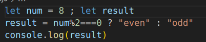

### Arrow (⇒) function :

→ no need to use keyword function if you do not assign a name to it 

→ no need of braces or return keyword if the function only has one line

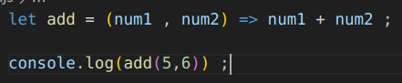

### “This” keyword

→ This represents the current object 

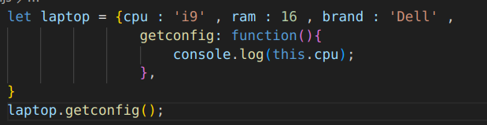

### Constructor function

→To differentiate b/w normal function and constructor function use capital 1st letter for constructor function

→Will have to use **“new”** keyword 

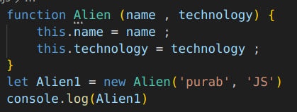

### Arrays

→ Arrays in JS can contain any datatype , as well as a mixture of datatypes

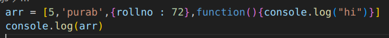

### Array methods

- push : adds an element at the end
- pop : returns the last element
- shift : returns the first element
- unshift : adds an element in the start
- splice :
    
    → splice(n) : removes all elements after n 
    
    → splice(n,m) : removes ‘m’ elements starting from n 
    
    → splice(n,m,xyz…..) : removes ‘m’ elements starting from n and adds elements xyz in place of them 
    

### Array Destructuring

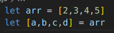

### ‘forEach’ method in JS

executes a function on each of the elements of an array 

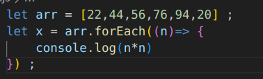

### Set in JS

→ collection of elements 

→ only has unique values 

→ unordered list (except in js)

→ does not have an index value 

→ ‘has’ method cross-checks if am element exists in a set

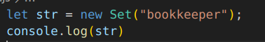

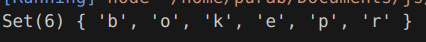

### Map in JS

→ key-value pair 

→ set : used set(not add) key-value pairs

⇒ i.e. existing values get updated 

→ get : used to get particular elements

### Value v/s Reference

→ When assigning a primitive data type value to a variable any changes are directly to that value , without affecting the original value 

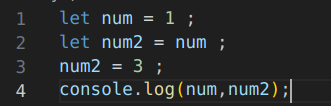

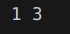

→When assigning non-primitive data type value to a variable is done by reference so any changes will affect all the references 

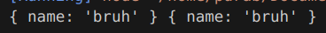

### Truthy and Falsy

→ Everything in JS is either Truthy of Falsy 

→ Falsy values :

‘ ’ , “ ” ,` ` , 0 , -0 , NaN , false , null , undefined

→ Truthy values :

Everything not included in Falsy 

### Variable Lookup

→ JS searches for a variable by variable name , first in the local scope and then in the global scope and uses the one it finds first and throws an error if there is no such variable

### Functions :

- Higher order functions :
    
    → Accepts another function as an argument or returns another function as a result 
    
    → in the example below greet is the higher order function
    
- Callback functions :
    
    → Functions that are passed to another function as an argument and executed inside that function
    
    → in the example below morning is the higher order function
    
    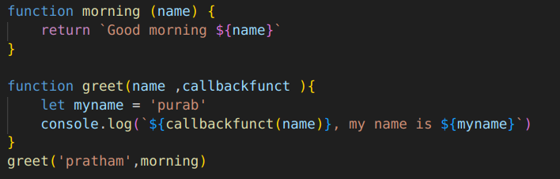
    
- do not invoke the callback function when passing it through the higher order function
    
    it gives a type error 
    

---