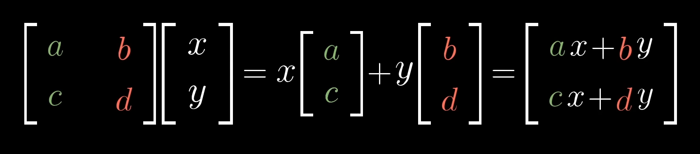

# Linear Algebra

---

---

## Vectors : What are they ?

- An arrow pointing somewhere in space
- List of numbers
- Each vector represents a certain movement with a certain distance and direction in the space
- Numbers “Scale” a vector i.e. stretch or squish it i.e. Scale them up or scale them down

## Span of vectors

- The set of all possible vectors you can reach with a linear combination of two (or three) vectors is called a span of those two(or three) vectors
- If a vector **ADDS** another dimension to the span then the vector is linearly i**ndependent**
- If a vector **DOES NOT ADD** another dimension to the span then the vector is linearly **dependent**

## Basis

- The basis of a space is set of linearly independent vectors that span that space

## Linear Transformations

- All lines must remain lines without getting curved
- Origin must stay in place
- Grid lines must stay **PARALLEL** and  **EVENLY SPACED**
- The information about a 2-D Linear Transformation is packaged in a 2*2 matrix :
    - 1st column is the vector where  *i*  lands and 2nd column is where *j*  lands
    
    
    
    - This basically ends up being matrix multiplication
- Multiplying 2 matrices implies applying 2 transformations one after the other
- **Shear :**
    
    One vector remains fixed , one gets transformed
    

## Determinant

- The factor by which a linear transformation changes any area(or volume) in 2-D(or 3-D) is known as the determinant of that transformation
- >0  : no flipping of space
    
    <0 : flipping takes place   
    
- >1 : scale up
    
    <1 : scale down
    
- 0 → point space

## Inverse of Matrix

- Inverse of a matrix reverses the effect caused by the given matrix
- If the determinant is 0 i.e. the matrix squishes the space to a lower dimension (line or point) it cannot be undone , therefore inverse does not exist
- rank 1 : transformation lies on a line
    
    rank 2 : transformation lies on a plane
    
- If a matrix has a rank of 3 and fills all space , then this set of all possible outputs is called the column space of a matrix

## Dot Product

- Product of length of projection of a vector and the length of vector the projection is taken on

## Cross Product

- Gives a vector with magnitude of area equal to area of parallelogram between two given vectors
- The vector is perpendicular to both the given vectors
- Direction is given by Right Hand Rule
- The determinant (change of area due to a transformation) gives the magnitude of the vector

## Duality

- The coincidence of correspondence between two mathematical properties/theorems is called duality
- Basically interchangeably with each other while explaining a certain topic
    
    ### Duality in LA 2-D
    
- The idea of duality is that any time you have linear transformation some space(2-D) to the number line(1-D) it is associated with a unique vector in that space , in the sense that performing the linear transformation is the same as taking a dot product with that vector

## Change of Basis

- Representing same vector in different basis is like saying same sentence in different languages
- To find the change to the vector that would take place in a different basis
    
    → Apply change of basis matrix
    
    → Apply transformation
    
    → Apply inverse of change of basis matrix
    

## Eigenvalues and Eigenvectors

- Eigenvector is a vector that remains on its span(the line originally passing through the vector) even after some transformation matrix acts on it
- The transformation only leads to a stretching or squishing the eigenvector
- The factor by which the eigenvector is scaled up(stretched) or scaled down(squished) is known as the Eigenvalue
- If we apply change of basis to the eigenvector matrix we get a new basis known as eigenbasis which is represented by a diagonal matrix each element of which is an eigenvalue

## Vector spaces

- Set of vectors/functions/lists etc. that satisfy the axioms of LA are called vector spaces